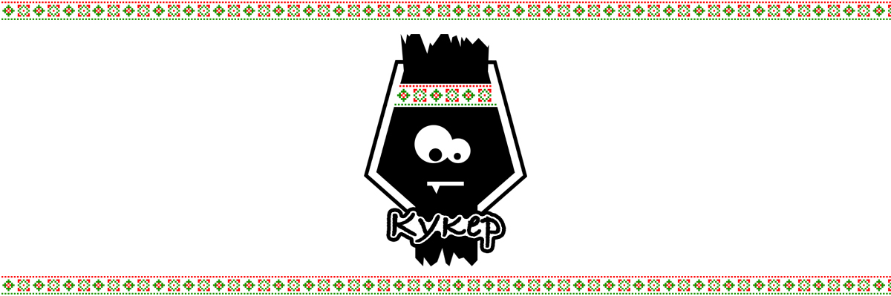

---

<p align="center">
Kuker :heart:
<a href="#integration-with-react">React</a>, 
<a href="#integration-with-angular">Angular</a>, 
<a href="#integration-with-vue">Vue & Vuex</a>, 
<a href="#integration-with-redux">Redux</a>, 
<a href="#integration-with-redux-saga">redux-saga</a>, 
<a href="#html-emitter">HTML</a>, 
<a href="#integration-with-stent">Stent</a>, 
<a href="#integration-with-machinajs">Machina.js</a>, 
<a href="#integration-with-mobx">MobX</a>
</p>

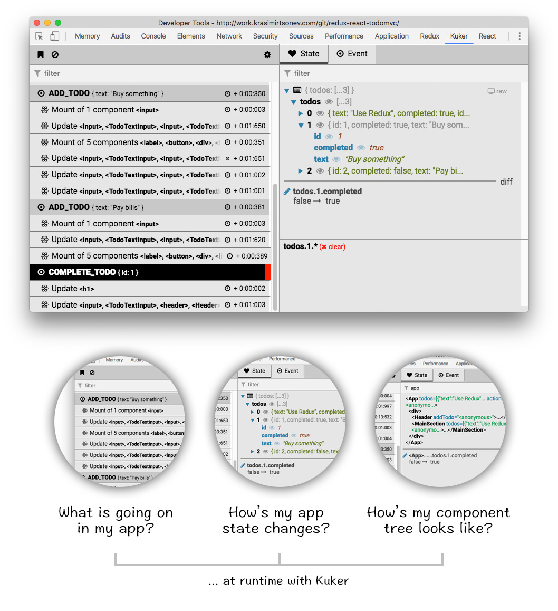

---

<p align="center">You want your framework listed here? Check out the <a href="#emitters">Emitters</a> section and learn how to integrate it with Kuker.</p>

## How to use it

* Install the extension from [Chrome Web Store](https://chrome.google.com/webstore/detail/glgnienmpgmfpkigngkmieconbnkmlcn).
* [Instrument your app](https://github.com/krasimir/kuker#instrumentation) so it sends messages

## Features

* Tracking of events/actions in your app
* Tracking of application state and its mutations
* Monitoring of server-side rendering (via Socket.io)
* Filtering of events/actions and focusing on specific portion of the application state
* Monitoring for changes in a specific portion of the state
* Filtering of event sources
* Clearing all the events or adding a red flag so you know which are the new ones

## Philosophy

If you build software you probably know that debugging what you just wrote is really important. Without seeing how your code works on a lower level you can't say that something is done. Finding and fixing bugs is also important. And without a proper tool it becomes difficult and time consuming. [Kuker](https://chrome.google.com/webstore/detail/glgnienmpgmfpkigngkmieconbnkmlcn) is here to help by improving your workflow.

---

I'm working with React, Redux and redux-saga last years and they seem to have pretty active community. Community that built awesome tools which improve the developer experience. One of these tools is [Redux-DevTools](https://github.com/zalmoxisus/redux-devtools-extension). I got lots of ideas from there and my goal in the beginning was to write (for fun) a clone with a little bit more features. Stuff which I wanted to see. However, later I realized that this may be used out of Redux context and basically support every library or framework. It answers of two important questions.

* What is going on in my application? In Redux this is pretty much the actions which fly around. But in your app this may be events or streams. It is just an **action** that happened at specific point of time. Think about a timeline with bunch keyframes.
* How my application state changes based on these actions/events? Seeing how your app state mutates based on actions is priceless. You are able to spot bugs and see what is causing them. What state means depends on the context. For Redux this is the store, for React this is the React tree.

The extension answers on these two questions. We have two panels. The one on the left shows a list of all the actions/events in your application while the one on the right displays the state after each one of them.

The following screenshot demonstrate how the extension works with [React emitter](https://github.com/krasimir/kuker-emitters) and [Redux emitter](https://github.com/krasimir/kuker-emitters) plugged in:

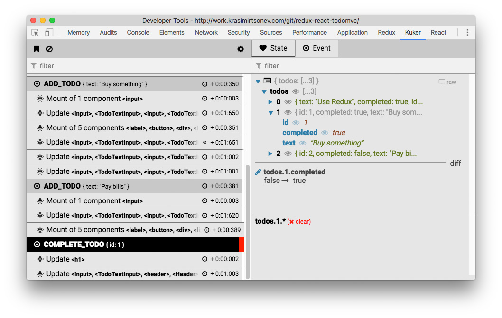

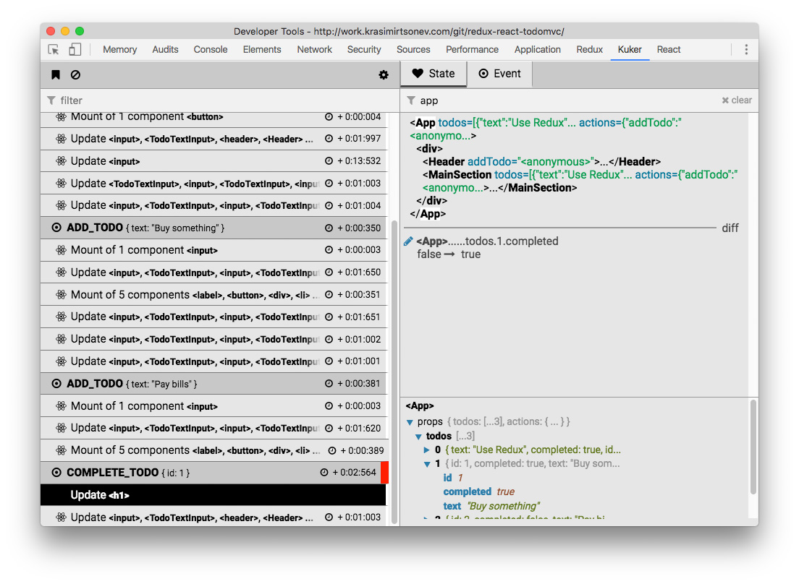

*(The screenshots are made of [this TodoMVC example](http://work.krasimirtsonev.com/git/redux-react-todomvc/). If you install the extension and open the app you'll see a similar result.)*

## Instrumentation

To make the extension work you have to *instrument* your application. You have to add an [_emitter_](https://github.com/krasimir/kuker-emitters) which listens for actions/events on your side and sends them to [Kuker](https://chrome.google.com/webstore/detail/glgnienmpgmfpkigngkmieconbnkmlcn).

## Emitters

* [React](#integration-with-react)
* [Angular](#integration-with-angular)
* [Vue and Vuex](#integration-with-vue)
* [Redux](#integration-with-redux)
* [redux-saga](#integration-with-redux-saga)
* [HTML](#html-emitter)
* [Stent](#integration-with-stent)
* [Machina.js](#integration-with-machinajs)
* [MobX](#integration-with-mobx)
* [Base emitter](#baseemitter)

### Installing emitters

`yarn add kuker-emitters` or `npm install kuker-emitters`. There're also standalone versions in [here](./standalone). You may grab the file, include it in your page and you'll a global like `ReduxEmitter`, `ReduxSagaEmitter` or `ReactEmitter`.

### Integration with [React](https://reactjs.org/)

```js
import { ReactEmitter } from 'kuker-emitters';

ReactEmitter();
```

[TodoMVC example](http://work.krasimirtsonev.com/git/redux-react-todomvc/)

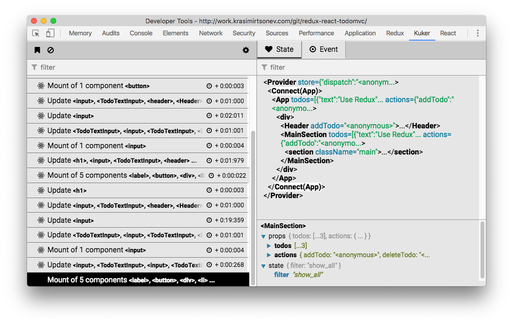

### Integration with [Angular](https://angular.io/)

```js
import { AngularEmitter } from 'kuker-emitters';

AngularEmitter();
```

`AngularEmitter` accepts a single parameter `options` which by default is equal to `{ rootSelector: 'app-root' }`. The root element in a Angular app is usually `app-root` (at least in the latest versions). If it happens to be a different one set the proper selector. Also you should compile your app in a development mode. Otherwise `ng.probe` is not available and the emitter can not send events.

[Simple Angular application](http://work.krasimirtsonev.com/angular-test/)

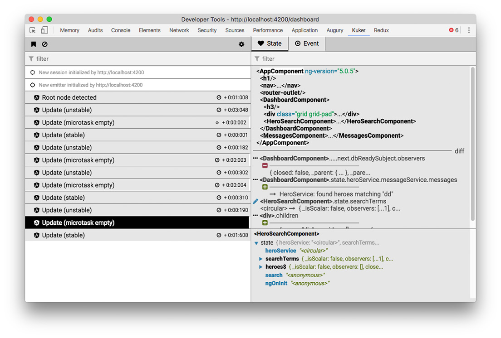

### Integration with [Vue](https://github.com/vuejs/)

```js
import { VueEmitter } from 'kuker-emitters';

VueEmitter();
```

The same `VueEmitter` works for [Vuex](https://github.com/vuejs/vuex) too.

* [TodoMVC example](http://work.krasimirtsonev.com/git/vuex-vue-todomvc/)
* [Codepen example](https://codepen.io/krasimir/pen/EoLddv?editors=1010)

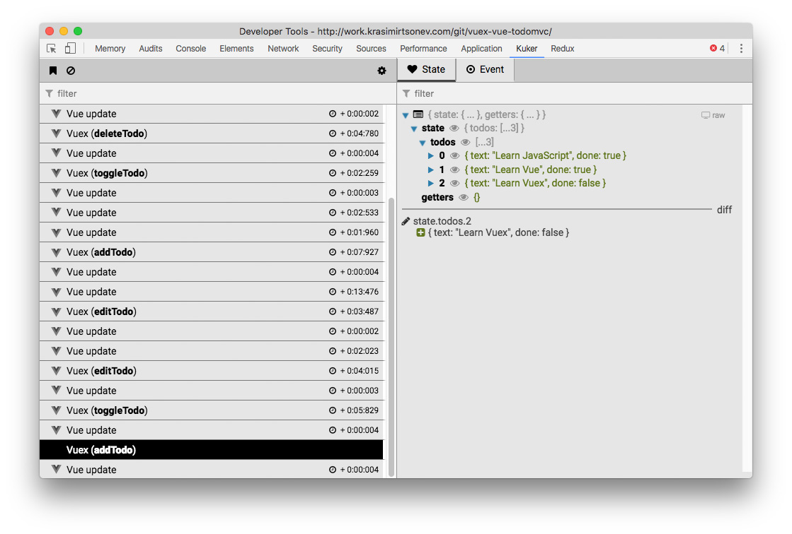

### Integration with [Redux](https://redux.js.org/)

```js
import { createStore, applyMiddleware } from 'redux';
import { ReduxEmitter } from 'kuker-emitters';

const middleware = ReduxEmitter();

const store = createStore(<reducer>, applyMiddleware(middleware));
```

* [Codepen example](https://codepen.io/krasimir/pen/vpYrqw)
* [TodoMVC example](http://work.krasimirtsonev.com/git/redux-react-todomvc/)

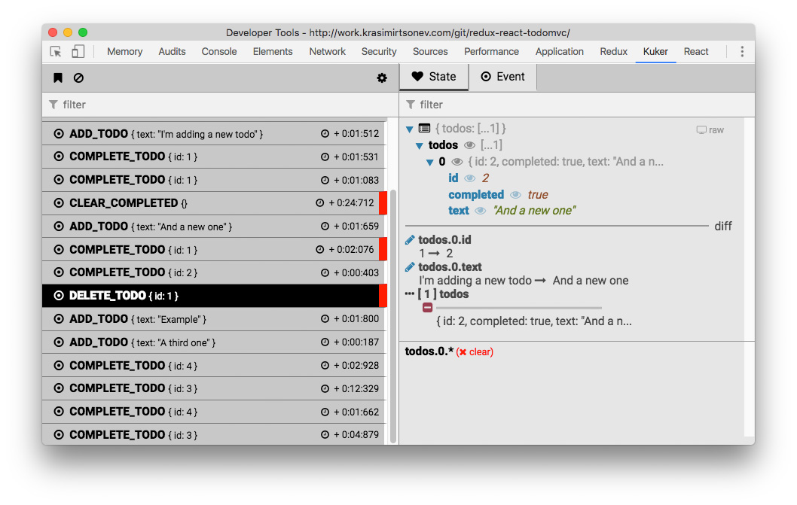

### Integration with [redux-saga](https://redux-saga.js.org/)

```js
import { createStore, applyMiddleware } from 'redux';
import { ReduxSagaEmitter } from 'kuker-emitters';
import createSagaMiddleware from 'redux-saga';

const emitter = ReduxSagaEmitter();
const sagaMiddleware = createSagaMiddleware({ sagaMonitor: emitter.sagaMonitor });

const store = createStore(<reducer>, applyMiddleware(sagaMiddleware));

// This bit is really important.
// Without it you won't get the current state of the app with every event.
emitter.setStore(store);

sagaMiddleware.run(rootSaga)
```

* [Codepen example](https://codepen.io/krasimir/pen/vpYrqw)
* [jsFiddle example](http://jsfiddle.net/726o9zp2/1/)

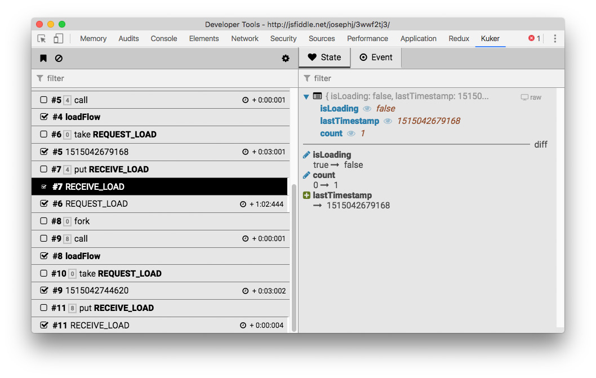

### HTML emitter

```js
import { HTMLEmitter } from 'kuker-emitters';

HTMLEmitter();
```

[Codepen example](https://codepen.io/krasimir/pen/aEKjWY?editors=0010)

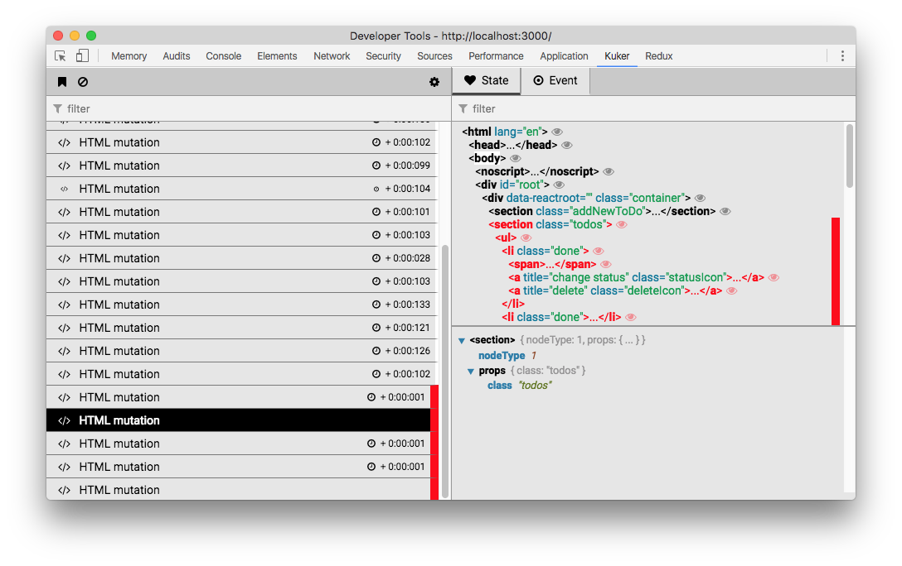

### Integration with [Stent](https://github.com/krasimir/stent)

```js
import { Machine } from 'stent';
import { StentEmitter } from 'kuker-emitters';

Machine.addMiddleware(StentEmitter());
```

[Codepen example](https://codepen.io/krasimir/pen/YEjYvR)

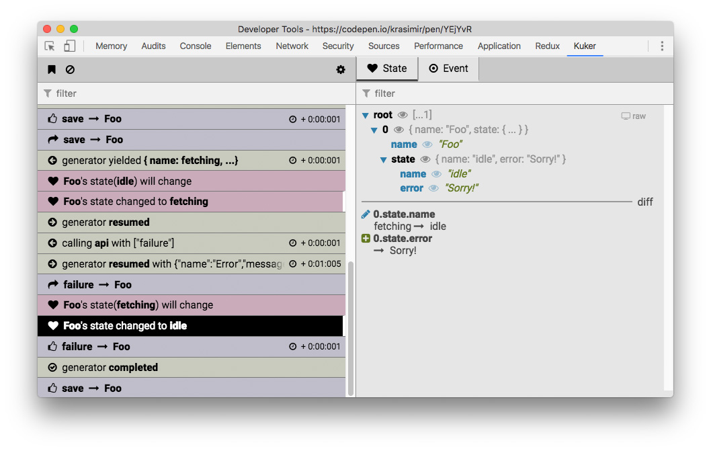

### Integration with [Machina.js](http://machina-js.org/)

```js
import machina from 'machina';
import { MachinaEmitter } from 'kuker-emitters';

const machine = new machina.Fsm({...});

MachinaEmitter(machine);
```

[Codepen example](https://codepen.io/krasimir/pen/aEOpvE)

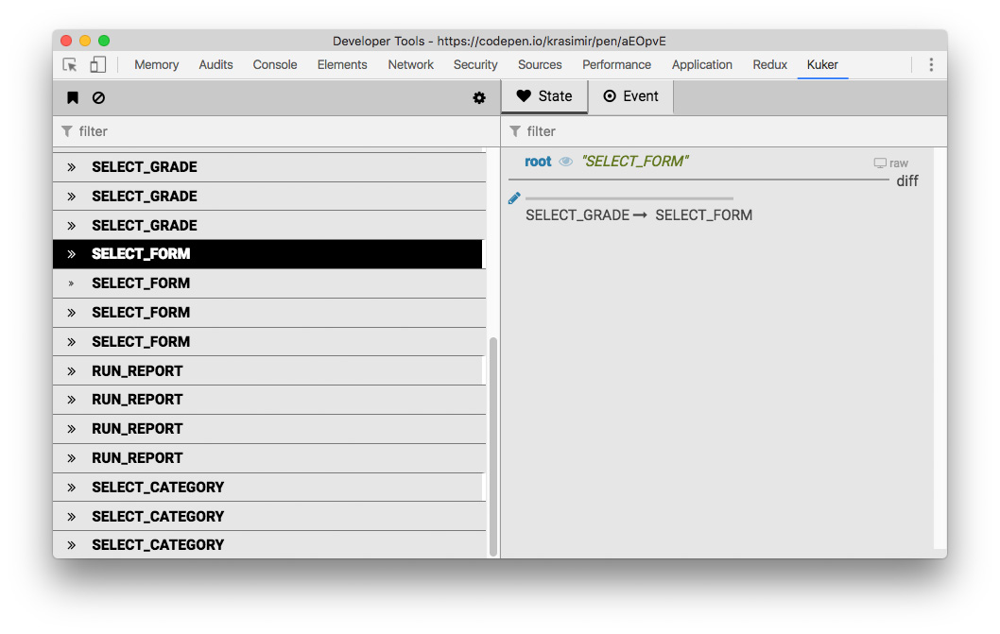

### Integration with [MobX](https://mobx.js.org/)

```js
import { MobXEmitter } from 'kuker-emitters';
import { spy, observable, action } from 'mobx';

class Person {
  @observable age = 33;
  @action newYear() {
    this.age += 1;
  }
}

const person = new Person();

MobXEmitter(spy, [ person ]);
```

[Codepen example](https://codepen.io/krasimir/pen/LeRqRg)

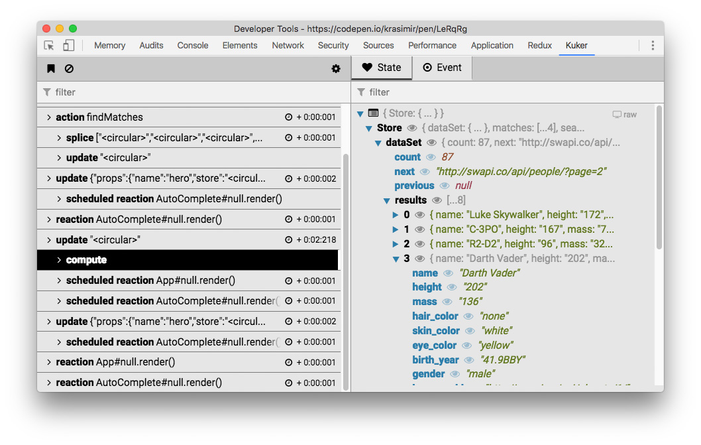

### BaseEmitter

```js
import { BaseEmitter } from 'kuker-emitters';

const emit = BaseEmitter();

emit({
  type: 'adding money to my account',
  label: 'hello',
  state: { bank: { money: 100 } },
  icon: 'fa-money',
  color: '#bada55'
});
```

[Codepen example](https://codepen.io/krasimir/pen/ypNVVm)

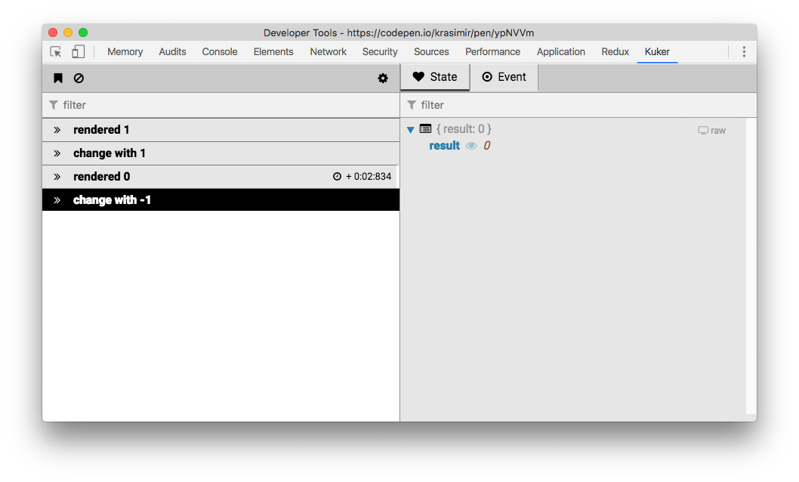

### Writing your own Emitter

Of course you don't have to use any of these emitters to enjoy [Kuker](https://chrome.google.com/webstore/detail/glgnienmpgmfpkigngkmieconbnkmlcn). You may send a message on your own using the [`postMessage`](https://developer.mozilla.org/en-US/docs/Web/API/Window/postMessage) API:

```js
window.postMessage({
  kuker: true,
  type: 'adding money to my account',
  origin: 'something',
  label: 'hello',
  time: (new Date()).getTime(),
  state: { bank: { money: 100 } },
  icon: 'fa-money',
  color: '#bada55'
}, '*');
```

The result of this `postMessage` call is as follows:

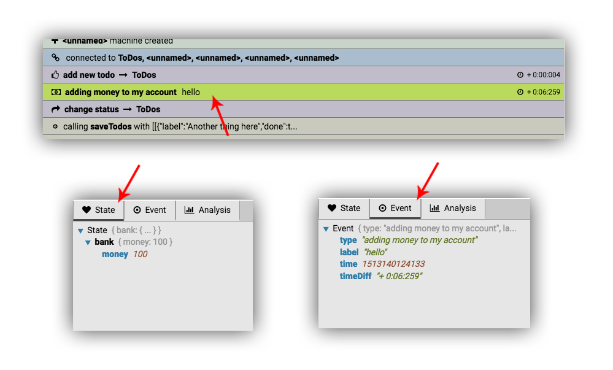

The only required properties are `type` and `kuker: true`. You may skip the others if you want. `icon` is one of the [FontAwesome](http://fontawesome.io/icons/) icons.

The problem of doing it alone is that you have to take care for a two things:

* Your state may contain stuff which are not easily serializable.
* You have to check if `window.postMessage` is available (does not exist in node environment).

All these three issues are solved by using the [BaseEmitter](#baseemitter).

*I'll be more then happy to see you contributing to [kuker-emitters](https://github.com/krasimir/kuker-emitters). There're also utility functions for calling `postMessage`.*

## In production

In the beginning there was a guard in the emitters that makes sure that events are sent only if the extension is installed. However, this technique involves the [content script](https://developer.chrome.com/extensions/content_scripts) of the extension to inject some stuff on the page which was fragile and buggy. I decided to kill that feature until I find a better way to handle it. So, for the time being you have to guard the emitters.

## How it works

Once you load the app the integrated emitters start calling `window.postMessage`. The [content script](https://developer.chrome.com/extensions/content_scripts) is listening for this messages and via the `chrome.runtime` API sends them to the DevTools panel. The rest is just a small React app that displays them.

## Misc

* Inspired by [Redux-DevTools](https://github.com/zalmoxisus/redux-devtools-extension)
