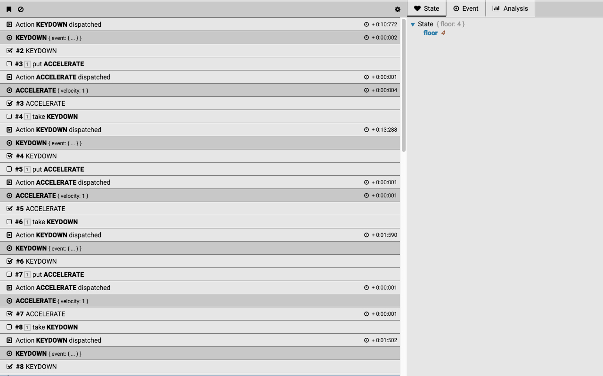

# Kuker


Chrome extension to debug your apps.

Install it from here [chrome.google.com/webstore/detail/glgnienmpgmf...](https://chrome.google.com/webstore/detail/glgnienmpgmfpkigngkmieconbnkmlcn).

## Philosophy

If you build software you probably know that debugging what you just wrote is really important. Without seeing how your code works on a lower level you can't say that something is done. Finding and fixing bugs is also important. And without a proper tool it becomes difficult and time consuming. [Kuker](https://chrome.google.com/webstore/detail/glgnienmpgmfpkigngkmieconbnkmlcn) is here to help by improving your workflow.

---

I'm working with React and Redux last years and they seem to have pretty active community. Community that built awesome tools which improve the developer experience. One of these tools is [Redux-DevTools](https://github.com/zalmoxisus/redux-devtools-extension). I got lots of ideas from there and my goal in the beginning was to write (for fun) a clone with a little bit more features. Stuff which I wanted to see. However, later I realized that this may be used out of Redux context and basically support every library or framework. It is just answering of two important questions.

* What is going on in my application? In Redux this is pretty much the actions tha fly around. But in your app this may be events or streams or whatever. It is just a **thing** happening in specific point of time. Think about a timeline with bunch of points inside.
* How my application changes based on actions/events happening in my application? It is all about state right. Seeing how your app state mutates based on actions is priceless. You are able to spot bugs and see what is causing them.

The extension answers on these two questions. We have two panels. The one on the left shows a list of all the actions/events in your application while the one on the right displays the state after each one of them.



*(The screenshot is made of the [this Codepen](https://codepen.io/krasimir/pen/vpYrqw))

### Posting a message to the extension

```js
window.top.postMessage({
  time: (new Date()).getTime(),
  state: { bank: { money: 0 } },
  label: 'Take my money',
  icon: 'fa-money'
}, '*');
```

*`icon` is one of the FontAwesome icons. Check out [here](http://fontawesome.io/icons/).*

## Misc

* Inspired by [Redux-DevTools](https://github.com/zalmoxisus/redux-devtools-extension)
